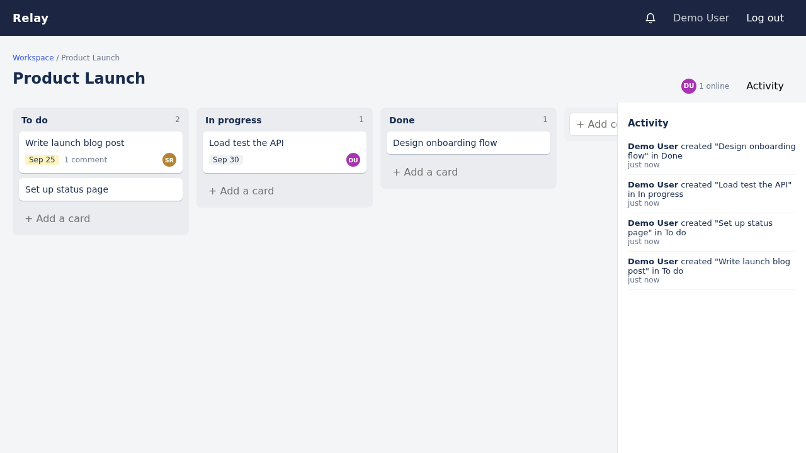
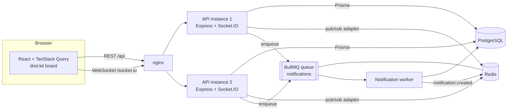

# Relay

A real-time collaborative project board, in the spirit of Trello and Linear.
Teams work in **workspaces** that contain **boards**, **columns** and **cards**. Cards have assignees, due dates, comments and an activity log, and every change shows up live for everyone on the board.



**Stack:** React, TypeScript, Vite, TanStack Query, dnd-kit · Node.js, Express, Socket.IO · PostgreSQL with Prisma · Redis (Socket.IO adapter + BullMQ) · Docker Compose · GitHub Actions · Vitest · Playwright

## Features

- **Multi-tenant workspaces** with roles: owner, admin, member, viewer. Every API call checks the caller's role in the workspace that owns the resource, and non-members get a 404 so IDs from other tenants are never revealed.
- **Drag-and-drop boards** (dnd-kit) with fractional positions: moving a card rewrites only that card's row, not the whole column. Columns are re-spaced automatically if two positions get too close.
- **Real-time updates** over Socket.IO: card and column changes, comments and activity stream to everyone on the board, plus a "who's online" presence list.
- **Horizontal scaling:** the Socket.IO Redis adapter fans events out across API instances. Docker Compose runs two API replicas to prove it.
- **Background jobs** with BullMQ: assignment, comment and due-soon notifications are queued in Redis, retried with exponential backoff, and pushed to the user live.
- **Auth:** short-lived JWT access tokens (15 min, kept in memory) and httpOnly refresh-token cookies with rotation. Reusing an old refresh token revokes all of that user's sessions.
- **Card details:** description, assignee, due date with overdue/soon badges, comments and a per-card activity history.
- **Tests and CI:** unit tests, API integration tests against real Postgres, and Playwright end-to-end tests (including a two-browser live-update test) on every push.

## Architecture



**How a change flows:** a user drags a card. The client updates its local state right away, then calls `POST /api/cards/:id/move` with the IDs of the new neighbours. The API checks the user's role, computes a position between the neighbours, saves it, writes an activity row, and emits `card:moved` to the board's Socket.IO room. Through the Redis adapter, that event reaches clients connected to any API instance, and their TanStack Query caches refetch the board.

### Data model

```
User ─┬─< Membership >─ Workspace ─< Board ─< Column ─< Card ─< Comment
      │     (role)                    │                  │
      │                               └──────< Activity >┘
      ├─< RefreshToken
      └─< Notification
```

See [`apps/server/prisma/schema.prisma`](apps/server/prisma/schema.prisma).

### Roles

| Action | Viewer | Member | Admin | Owner |
| --- | :-: | :-: | :-: | :-: |
| View boards, cards, activity | ✓ | ✓ | ✓ | ✓ |
| Create/move/edit cards, comment, create boards | | ✓ | ✓ | ✓ |
| Rename/delete boards and columns, manage members | | | ✓ | ✓ |
| Grant admin/owner, delete workspace | | | | ✓ |

## Getting started

### Option 1: everything in Docker

```bash
docker compose up --build
```

Open http://localhost:8080 and sign up. This runs Postgres, Redis, two API replicas and the web app behind nginx.

### Option 2: local development

Requirements: Node 22+, Docker (for Postgres and Redis).

```bash
npm install
cp .env.example apps/server/.env
docker compose up -d postgres redis
npm run db:migrate -w apps/server
npm run db:seed -w apps/server      # optional demo data
npm run dev                         # API on :4000, web on :5173
```

Open http://localhost:5173. With seed data you can log in as `demo@relay.dev` / `password123`.

Redis is optional for local development: without `REDIS_URL`, Socket.IO uses its in-memory adapter and notification jobs run inline.

## Testing

```bash
npm run lint
npm run typecheck
npm test                  # unit tests + API integration tests (needs DATABASE_URL)
npm run build -w apps/server
npm run test:e2e          # Playwright; starts the API and web app itself
```

CI (`.github/workflows/ci.yml`) runs lint, typecheck and tests against a Postgres service, then the Playwright suite against Postgres and Redis.

## Project structure

```
apps/
  server/
    prisma/            schema, migrations, seed
    src/
      routes/          auth, workspaces, boards/columns, cards, notifications
      lib/             permissions, tenant access checks, ordering, tokens
      realtime/        Socket.IO server, rooms, presence
      jobs/            BullMQ notification queue + worker, due-soon scan
    test/              unit + API integration tests
  web/
    src/
      pages/           auth, workspaces, workspace, board
      components/      columns, cards, card modal, activity feed, notifications
      hooks/           auth, shared socket, board realtime
    e2e/               Playwright tests
docker-compose.yml
```

## API overview

| Method | Path | Description |
| --- | --- | --- |
| POST | `/api/auth/register`, `/login`, `/refresh`, `/logout` | Session management |
| GET/POST | `/api/workspaces` | List / create workspaces |
| GET/PATCH/DELETE | `/api/workspaces/:id` | Workspace details |
| POST/PATCH/DELETE | `/api/workspaces/:id/members[/:userId]` | Manage members and roles |
| POST | `/api/workspaces/:id/boards` | Create a board (with default columns) |
| GET/PATCH/DELETE | `/api/boards/:id` | Board with columns and cards |
| GET | `/api/boards/:id/activity` | Board activity log |
| POST | `/api/boards/:id/columns` | Add a column |
| PATCH/DELETE | `/api/columns/:id` | Rename, reorder or delete a column |
| POST | `/api/columns/:id/cards` | Create a card |
| GET/PATCH/DELETE | `/api/cards/:id` | Card details, update, delete |
| POST | `/api/cards/:id/move` | Move or reorder a card |
| POST | `/api/cards/:id/comments` | Comment on a card |
| GET | `/api/notifications` | Notifications for the current user |

Socket events: `board:join`, `board:leave`, `presence`, `card:created|updated|moved|deleted`, `column:created|updated|deleted`, `comment:created`, `activity:created`, `notification:created`.

## Roadmap

- Email delivery for notifications (the worker has a hook for a provider such as SES or Resend)
- Labels, card search and filters
- Optimistic updates for card edits
- Deployment (Render or Fly.io for the API, Vercel for the web app)

## License

MIT
